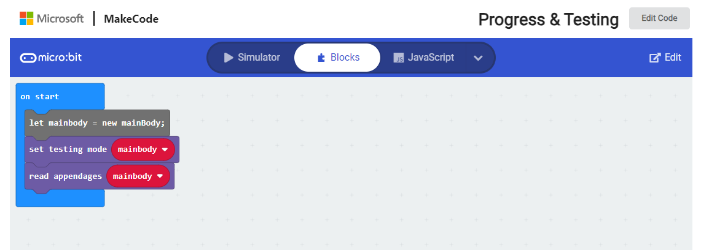

# Code Documentation for Full STEAM Ahead
### Samay Chandna

#### Useful Links
* [micro:bit API for TS](https://www.augmentedmind.de/2020/04/12/an-introduction-to-the-microbit-for-software-developers/)
* [micro:bit Progress with Simulator](https://makecode.microbit.org/_6Y6azqKkKF0U)

#### Progress Made so far
* 26/09/2023
  * [Have skeleton working in block code](https://makecode.microbit.org/_6Y6azqKkKF0U)
  * 