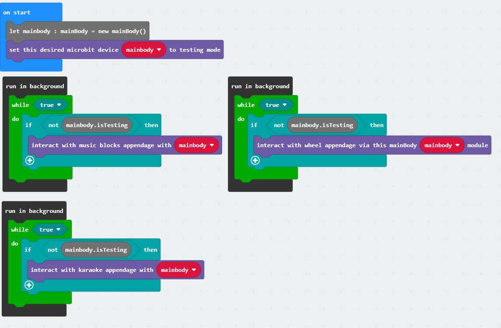
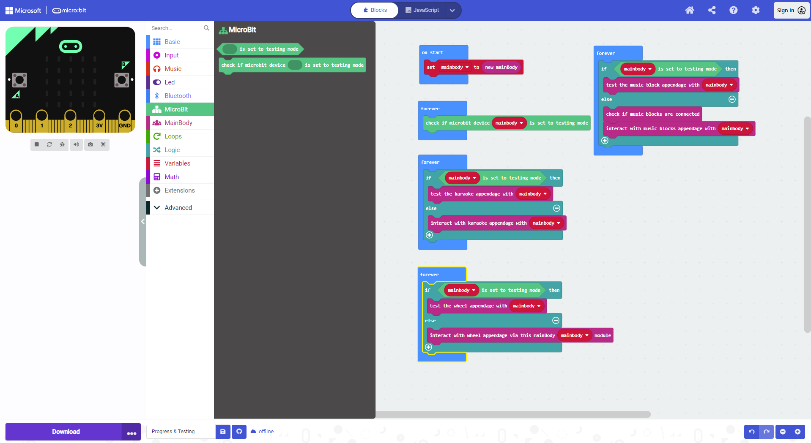
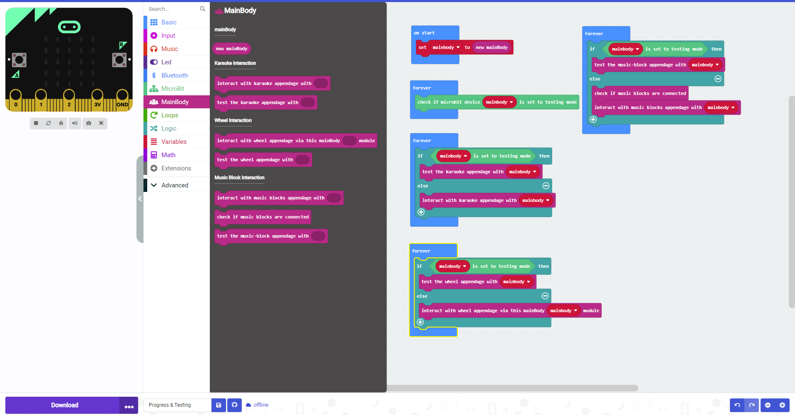
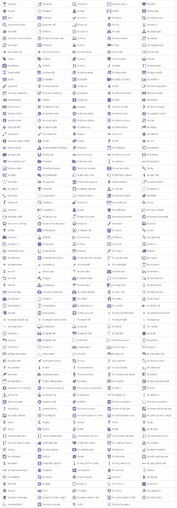

# Code Documentation for Full STEAM Ahead
### Samay Chandna

#### Useful Links
* [micro:bit API for TS](https://makecode.microbit.org/reference)
* [micro:bit Pinout](https://makecode.microbit.org/device/pins)
* [micro:bit Progress with Simulator](https://makecode.microbit.org/_6Y6azqKkKF0U)

#### Progress Made so far
* 26/09/2023
  * [Have skeleton working in block code](https://makecode.microbit.org/_6Y6azqKkKF0U)
  * 
* 28/09/2023
  * [Moved from naive implementation to I2C](https://makecode.microbit.org/S04872-52139-73553-07116)
  * 
  * 
* 24/10/2023
  * Little bit of absence due to midterms, break, and interviews
  * Great progress made, all the block code looks production-ready
  * 
  * 
  * Deleted all deprecated python code
  * Deleted all TS files that are not being used
  * Got rid of custom.ts, made seperate modules for each (makes MUCH more sense)
  * Added PCB to github repo
  * Added my parts of CDR document and presentation

#### Helpful Notes

*"\uf000", "id": "fa-glass"

*"\uf001", "id": "fa-music"

*"\uf002", "id": "fa-search"

*"\uf003", "id": "fa-envelope-o"

*"\uf004", "id": "fa-heart"

*"\uf005", "id": "fa-star"

*"\uf006", "id": "fa-star-o"

*"\uf007", "id": "fa-user"

*"\uf008", "id": "fa-film"

*"\uf009", "id": "fa-th-large"

*"\uf00a", "id": "fa-th"

*"\uf00b", "id": "fa-th-list"

*"\uf00c", "id": "fa-check"

*"\uf00d", "id": "fa-times"

*"\uf00e", "id": "fa-search-plus"

*"\uf010", "id": "fa-search-minus"

*"\uf011", "id": "fa-power-off"

*"\uf012", "id": "fa-signal"

*"\uf013", "id": "fa-cog"

*"\uf014", "id": "fa-trash-o"

*"\uf015", "id": "fa-home"

*"\uf016", "id": "fa-file-o"

*"\uf017", "id": "fa-clock-o"

*"\uf018", "id": "fa-road"

*"\uf019", "id": "fa-download"

*"\uf01a", "id": "fa-arrow-circle-o-down"

*"\uf01b", "id": "fa-arrow-circle-o-up"

*"\uf01c", "id": "fa-inbox"

*"\uf01d", "id": "fa-play-circle-o"

*"\uf01e", "id": "fa-repeat"

*"\uf021", "id": "fa-refresh"

*"\uf022", "id": "fa-list-alt"

*"\uf023", "id": "fa-lock"

*"\uf024", "id": "fa-flag"

*"\uf025", "id": "fa-headphones"

*"\uf026", "id": "fa-volume-off"

*"\uf027", "id": "fa-volume-down"

*"\uf028", "id": "fa-volume-up"

*"\uf029", "id": "fa-qrcode"

*"\uf02a", "id": "fa-barcode"

*"\uf02b", "id": "fa-tag"

*"\uf02c", "id": "fa-tags"

*"\uf02d", "id": "fa-book"

*"\uf02e", "id": "fa-bookmark"

*"\uf02f", "id": "fa-print"

*"\uf030", "id": "fa-camera"

*"\uf031", "id": "fa-font"

*"\uf032", "id": "fa-bold"

*"\uf033", "id": "fa-italic"

*"\uf034", "id": "fa-text-height"

*"\uf035", "id": "fa-text-width"

*"\uf036", "id": "fa-align-left"

*"\uf037", "id": "fa-align-center"

*"\uf038", "id": "fa-align-right"

*"\uf039", "id": "fa-align-justify"

*"\uf03a", "id": "fa-list"

*"\uf03b", "id": "fa-outdent"

*"\uf03c", "id": "fa-indent"

*"\uf03d", "id": "fa-video-camera"

*"\uf03e", "id": "fa-picture-o"

*"\uf040", "id": "fa-pencil"

*"\uf041", "id": "fa-map-marker"

*"\uf042", "id": "fa-adjust"

*"\uf043", "id": "fa-tint"

*"\uf044", "id": "fa-pencil-square-o"

*"\uf045", "id": "fa-share-square-o"

*"\uf046", "id": "fa-check-square-o"

*"\uf047", "id": "fa-arrows"

*"\uf048", "id": "fa-step-backward"

*"\uf049", "id": "fa-fast-backward"

*"\uf04a", "id": "fa-backward"

*"\uf04b", "id": "fa-play"

*"\uf04c", "id": "fa-pause"

*"\uf04d", "id": "fa-stop"

*"\uf04e", "id": "fa-forward"

*"\uf050", "id": "fa-fast-forward"

*"\uf051", "id": "fa-step-forward"

*"\uf052", "id": "fa-eject"

*"\uf053", "id": "fa-chevron-left"

*"\uf054", "id": "fa-chevron-right"

*"\uf055", "id": "fa-plus-circle"

*"\uf056", "id": "fa-minus-circle"

*"\uf057", "id": "fa-times-circle"

*"\uf058", "id": "fa-check-circle"

*"\uf059", "id": "fa-question-circle"

*"\uf05a", "id": "fa-info-circle"

*"\uf05b", "id": "fa-crosshairs"

*"\uf05c", "id": "fa-times-circle-o"

*"\uf05d", "id": "fa-check-circle-o"

*"\uf05e", "id": "fa-ban"

*"\uf060", "id": "fa-arrow-left"

*"\uf061", "id": "fa-arrow-right"

*"\uf062", "id": "fa-arrow-up"

*"\uf063", "id": "fa-arrow-down"

*"\uf064", "id": "fa-share"

*"\uf065", "id": "fa-expand"

*"\uf066", "id": "fa-compress"

*"\uf067", "id": "fa-plus"

*"\uf068", "id": "fa-minus"

*"\uf069", "id": "fa-asterisk"

*"\uf06a", "id": "fa-exclamation-circle"

*"\uf06b", "id": "fa-gift"

*"\uf06c", "id": "fa-leaf"

*"\uf06d", "id": "fa-fire"

*"\uf06e", "id": "fa-eye"

*"\uf070", "id": "fa-eye-slash"

*"\uf071", "id": "fa-exclamation-triangle"

*"\uf072", "id": "fa-plane"

*"\uf073", "id": "fa-calendar"

*"\uf074", "id": "fa-random"

*"\uf075", "id": "fa-comment"

*"\uf076", "id": "fa-magnet"

*"\uf077", "id": "fa-chevron-up"

*"\uf078", "id": "fa-chevron-down"

*"\uf079", "id": "fa-retweet"

*"\uf07a", "id": "fa-shopping-cart"

*"\uf07b", "id": "fa-folder"

*"\uf07c", "id": "fa-folder-open"

*"\uf07d", "id": "fa-arrows-v"

*"\uf07e", "id": "fa-arrows-h"

*"\uf080", "id": "fa-bar-chart-o"

*"\uf081", "id": "fa-twitter-square"

*"\uf082", "id": "fa-facebook-square"

*"\uf083", "id": "fa-camera-retro"

*"\uf084", "id": "fa-key"

*"\uf085", "id": "fa-cogs"

*"\uf086", "id": "fa-comments"

*"\uf087", "id": "fa-thumbs-o-up"

*"\uf088", "id": "fa-thumbs-o-down"

*"\uf089", "id": "fa-star-half"

*"\uf08a", "id": "fa-heart-o"

*"\uf08b", "id": "fa-sign-out"

*"\uf08c", "id": "fa-linkedin-square"

*"\uf08d", "id": "fa-thumb-tack"

*"\uf08e", "id": "fa-external-link"

*"\uf090", "id": "fa-sign-in"

*"\uf091", "id": "fa-trophy"

*"\uf092", "id": "fa-github-square"

*"\uf093", "id": "fa-upload"

*"\uf094", "id": "fa-lemon-o"

*"\uf095", "id": "fa-phone"

*"\uf096", "id": "fa-square-o"

*"\uf097", "id": "fa-bookmark-o"

*"\uf098", "id": "fa-phone-square"

*"\uf099", "id": "fa-twitter"

*"\uf09a", "id": "fa-facebook"

*"\uf09b", "id": "fa-github"

*"\uf09c", "id": "fa-unlock"

*"\uf09d", "id": "fa-credit-card"

*"\uf09e", "id": "fa-rss"

*"\uf0a0", "id": "fa-hdd-o"

*"\uf0a1", "id": "fa-bullhorn"

*"\uf0f3", "id": "fa-bell"

*"\uf0a3", "id": "fa-certificate"

*"\uf0a4", "id": "fa-hand-o-right"

*"\uf0a5", "id": "fa-hand-o-left"

*"\uf0a6", "id": "fa-hand-o-up"

*"\uf0a7", "id": "fa-hand-o-down"

*"\uf0a8", "id": "fa-arrow-circle-left"

*"\uf0a9", "id": "fa-arrow-circle-right"

*"\uf0aa", "id": "fa-arrow-circle-up"

*"\uf0ab", "id": "fa-arrow-circle-down"

*"\uf0ac", "id": "fa-globe"

*"\uf0ad", "id": "fa-wrench"

*"\uf0ae", "id": "fa-tasks"

*"\uf0b0", "id": "fa-filter"

*"\uf0b1", "id": "fa-briefcase"

*"\uf0b2", "id": "fa-arrows-alt"

*"\uf0c0", "id": "fa-users"

*"\uf0c1", "id": "fa-link"

*"\uf0c2", "id": "fa-cloud"

*"\uf0c3", "id": "fa-flask"

*"\uf0c4", "id": "fa-scissors"

*"\uf0c5", "id": "fa-files-o"

*"\uf0c6", "id": "fa-paperclip"

*"\uf0c7", "id": "fa-floppy-o"

*"\uf0c8", "id": "fa-square"

*"\uf0c9", "id": "fa-bars"

*"\uf0ca", "id": "fa-list-ul"

*"\uf0cb", "id": "fa-list-ol"

*"\uf0cc", "id": "fa-strikethrough"

*"\uf0cd", "id": "fa-underline"

*"\uf0ce", "id": "fa-table"

*"\uf0d0", "id": "fa-magic"

*"\uf0d1", "id": "fa-truck"

*"\uf0d2", "id": "fa-pinterest"

*"\uf0d3", "id": "fa-pinterest-square"

*"\uf0d4", "id": "fa-google-plus-square"

*"\uf0d5", "id": "fa-google-plus"

*"\uf0d6", "id": "fa-money"

*"\uf0d7", "id": "fa-caret-down"

*"\uf0d8", "id": "fa-caret-up"

*"\uf0d9", "id": "fa-caret-left"

*"\uf0da", "id": "fa-caret-right"

*"\uf0db", "id": "fa-columns"

*"\uf0dc", "id": "fa-sort"

*"\uf0dd", "id": "fa-sort-asc"

*"\uf0de", "id": "fa-sort-desc"

*"\uf0e0", "id": "fa-envelope"

*"\uf0e1", "id": "fa-linkedin"

*"\uf0e2", "id": "fa-undo"

*"\uf0e3", "id": "fa-gavel"

*"\uf0e4", "id": "fa-tachometer"

*"\uf0e5", "id": "fa-comment-o"

*"\uf0e6", "id": "fa-comments-o"

*"\uf0e7", "id": "fa-bolt"

*"\uf0e8", "id": "fa-sitemap"

*"\uf0e9", "id": "fa-umbrella"

*"\uf0ea", "id": "fa-clipboard"

*"\uf0eb", "id": "fa-lightbulb-o"

*"\uf0ec", "id": "fa-exchange"

*"\uf0ed", "id": "fa-cloud-download"

*"\uf0ee", "id": "fa-cloud-upload"

*"\uf0f0", "id": "fa-user-md"

*"\uf0f1", "id": "fa-stethoscope"

*"\uf0f2", "id": "fa-suitcase"

*"\uf0a2", "id": "fa-bell-o"

*"\uf0f4", "id": "fa-coffee"

*"\uf0f5", "id": "fa-cutlery"

*"\uf0f6", "id": "fa-file-text-o"

*"\uf0f7", "id": "fa-building-o"

*"\uf0f8", "id": "fa-hospital-o"

*"\uf0f9", "id": "fa-ambulance"

*"\uf0fa", "id": "fa-medkit"

*"\uf0fb", "id": "fa-fighter-jet"

*"\uf0fc", "id": "fa-beer"

*"\uf0fd", "id": "fa-h-square"

*"\uf0fe", "id": "fa-plus-square"

*"\uf100", "id": "fa-angle-double-left"

*"\uf101", "id": "fa-angle-double-right"

*"\uf102", "id": "fa-angle-double-up"

*"\uf103", "id": "fa-angle-double-down"

*"\uf104", "id": "fa-angle-left"

*"\uf105", "id": "fa-angle-right"

*"\uf106", "id": "fa-angle-up"

*"\uf107", "id": "fa-angle-down"

*"\uf108", "id": "fa-desktop"

*"\uf109", "id": "fa-laptop"

*"\uf10a", "id": "fa-tablet"

*"\uf10b", "id": "fa-mobile"

*"\uf10c", "id": "fa-circle-o"

*"\uf10d", "id": "fa-quote-left"

*"\uf10e", "id": "fa-quote-right"

*"\uf110", "id": "fa-spinner"

*"\uf111", "id": "fa-circle"

*"\uf112", "id": "fa-reply"

*"\uf113", "id": "fa-github-alt"

*"\uf114", "id": "fa-folder-o"

*"\uf115", "id": "fa-folder-open-o"

*"\uf118", "id": "fa-smile-o"

*"\uf119", "id": "fa-frown-o"

*"\uf11a", "id": "fa-meh-o"

*"\uf11b", "id": "fa-gamepad"

*"\uf11c", "id": "fa-keyboard-o"

*"\uf11d", "id": "fa-flag-o"

*"\uf11e", "id": "fa-flag-checkered"

*"\uf120", "id": "fa-terminal"

*"\uf121", "id": "fa-code"

*"\uf122", "id": "fa-reply-all"

*"\uf122", "id": "fa-mail-reply-all"

*"\uf123", "id": "fa-star-half-o"

*"\uf124", "id": "fa-location-arrow"

*"\uf125", "id": "fa-crop"

*"\uf126", "id": "fa-code-fork"

*"\uf127", "id": "fa-chain-broken"

*"\uf128", "id": "fa-question"

*"\uf129", "id": "fa-info"

*"\uf12a", "id": "fa-exclamation"

*"\uf12b", "id": "fa-superscript"

*"\uf12c", "id": "fa-subscript"

*"\uf12d", "id": "fa-eraser"

*"\uf12e", "id": "fa-puzzle-piece"

*"\uf130", "id": "fa-microphone"

*"\uf131", "id": "fa-microphone-slash"

*"\uf132", "id": "fa-shield"

*"\uf133", "id": "fa-calendar-o"

*"\uf134", "id": "fa-fire-extinguisher"

*"\uf135", "id": "fa-rocket"

*"\uf136", "id": "fa-maxcdn"

*"\uf137", "id": "fa-chevron-circle-left"

*"\uf138", "id": "fa-chevron-circle-right"

*"\uf139", "id": "fa-chevron-circle-up"

*"\uf13a", "id": "fa-chevron-circle-down"

*"\uf13b", "id": "fa-html5"

*"\uf13c", "id": "fa-css3"

*"\uf13d", "id": "fa-anchor"

*"\uf13e", "id": "fa-unlock-alt"

*"\uf140", "id": "fa-bullseye"

*"\uf141", "id": "fa-ellipsis-h"

*"\uf142", "id": "fa-ellipsis-v"

*"\uf143", "id": "fa-rss-square"

*"\uf144", "id": "fa-play-circle"

*"\uf145", "id": "fa-ticket"

*"\uf146", "id": "fa-minus-square"

*"\uf147", "id": "fa-minus-square-o"

*"\uf148", "id": "fa-level-up"

*"\uf149", "id": "fa-level-down"

*"\uf14a", "id": "fa-check-square"

*"\uf14b", "id": "fa-pencil-square"

*"\uf14c", "id": "fa-external-link-square"

*"\uf14d", "id": "fa-share-square"

*"\uf14e", "id": "fa-compass"

*"\uf150", "id": "fa-caret-square-o-down"

*"\uf151", "id": "fa-caret-square-o-up"

*"\uf152", "id": "fa-caret-square-o-right"

*"\uf153", "id": "fa-eur"

*"\uf154", "id": "fa-gbp"

*"\uf155", "id": "fa-usd"

*"\uf156", "id": "fa-inr"

*"\uf157", "id": "fa-jpy"

*"\uf158", "id": "fa-rub"

*"\uf159", "id": "fa-krw"

*"\uf15a", "id": "fa-btc"

*"\uf15b", "id": "fa-file"

*"\uf15c", "id": "fa-file-text"

*"\uf15d", "id": "fa-sort-alpha-asc"

*"\uf15e", "id": "fa-sort-alpha-desc"

*"\uf160", "id": "fa-sort-amount-asc"

*"\uf161", "id": "fa-sort-amount-desc"

*"\uf162", "id": "fa-sort-numeric-asc"

*"\uf163", "id": "fa-sort-numeric-desc"

*"\uf164", "id": "fa-thumbs-up"

*"\uf165", "id": "fa-thumbs-down"

*"\uf166", "id": "fa-youtube-square"

*"\uf167", "id": "fa-youtube"

*"\uf168", "id": "fa-xing"

*"\uf169", "id": "fa-xing-square"

*"\uf16a", "id": "fa-youtube-play"

*"\uf16b", "id": "fa-dropbox"

*"\uf16c", "id": "fa-stack-overflow"

*"\uf16d", "id": "fa-instagram"

*"\uf16e", "id": "fa-flickr"

*"\uf170", "id": "fa-adn"

*"\uf171", "id": "fa-bitbucket"

*"\uf172", "id": "fa-bitbucket-square"

*"\uf173", "id": "fa-tumblr"

*"\uf174", "id": "fa-tumblr-square"

*"\uf175", "id": "fa-long-arrow-down"

*"\uf176", "id": "fa-long-arrow-up"

*"\uf177", "id": "fa-long-arrow-left"

*"\uf178", "id": "fa-long-arrow-right"

*"\uf179", "id": "fa-apple"

*"\uf17a", "id": "fa-windows"

*"\uf17b", "id": "fa-android"

*"\uf17c", "id": "fa-linux"

*"\uf17d", "id": "fa-dribbble"

*"\uf17e", "id": "fa-skype"

*"\uf180", "id": "fa-foursquare"

*"\uf181", "id": "fa-trello"

*"\uf182", "id": "fa-female"

*"\uf183", "id": "fa-male"

*"\uf184", "id": "fa-gittip"

*"\uf185", "id": "fa-sun-o"

*"\uf186", "id": "fa-moon-o"

*"\uf187", "id": "fa-archive"

*"\uf188", "id": "fa-bug"

*"\uf189", "id": "fa-vk"

*"\uf18a", "id": "fa-weibo"

*"\uf18b", "id": "fa-renren"

*"\uf18c", "id": "fa-pagelines"

*"\uf18d", "id": "fa-stack-exchange"

*"\uf18e", "id": "fa-arrow-circle-o-right"

*"\uf190", "id": "fa-arrow-circle-o-left"

*"\uf191", "id": "fa-caret-square-o-left"

*"\uf192", "id": "fa-dot-circle-o"

*"\uf193", "id": "fa-wheelchair"

*"\uf194", "id": "fa-vimeo-square"

*"\uf195", "id": "fa-try"

*"\uf196", "id": "fa-plus-square-o")
